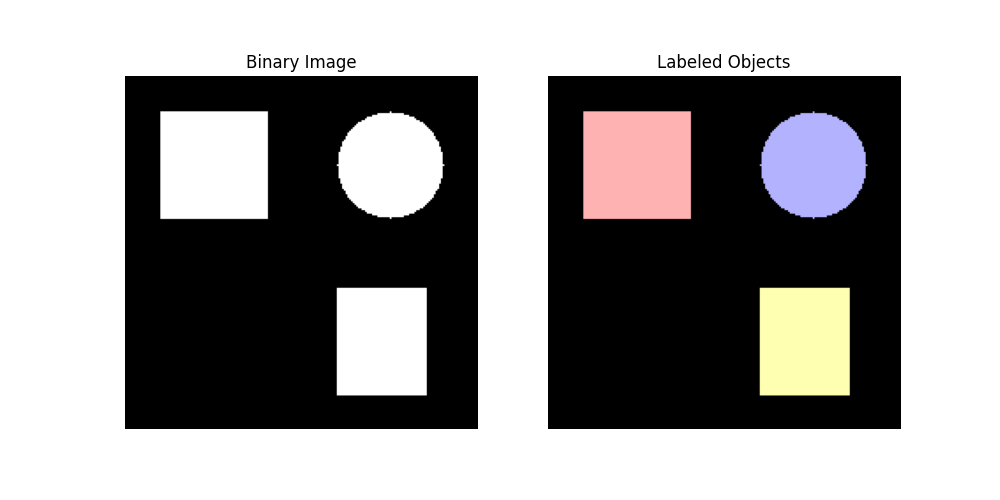

# Object Labeling and Counting (Connected Components)

## Project Overview
This project demonstrates object labeling and counting in binary images using connected component analysis. It's a foundational task in image processing used to detect and count distinct shapes or objects in binary or thresholded images.

- **Connected component labeling:** Tags and identifies groups of connected pixels ("objects") in a binary image.
- **Object counting:** Counts how many separate objects are present.
- **Visualization:** Detected objects are shown in different colors.

## Technologies Used
- Python 3.11
- OpenCV
- Numpy
- Scikit-image
- Matplotlib

## How it Works

1. **Binary Image Creation:** A simple binary image with geometric shapes is created (or you can use your own thresholded/BW image).
2. **Labeling:** Connected component analysis is performed to assign a unique label to each object.
3. **Counting:** The number of separate objects is counted and printed.
4. **Visualization:** A color image is generated, showing each object with a different color.

## Applications
- Medical image analysis (counting cells or nuclei)
- Industrial automation (counting parts, defects)
- Quality control
- Object tracking and region segmentation

## Installation

### Prerequisites
Python 3.11 or later.

### Install Required Libraries
pip install numpy opencv-python matplotlib scikit-image

## How to Run

1. Clone or download this repository and navigate to the folder:
cd project-2

2. Run the script:
python object_label_count.py

3. Output:
- The script will create a window showing the original binary image and the labeled (color) image.
- The number of detected objects will be printed in the terminal.
- Example output file: `output_labeling.png`

## Project Structure
project-2/
│
├── object_label_count.py # Main script
├── shapes.png # Input binary image (if used)
├── output_labeling.png # Saved output image showing labeled objects
└── README.md # Project instructions

## Output Example

The result shows how objects are detected and colored:

## Key Concepts

- **Connected Component:** A group of pixels connected to each other based on some criteria (usually 8-connectivity in 2D).
- **Labeling:** Assigning a unique number to each connected component (object).
- **Counting:** Counting the number of unique labels (excluding the background).
